# EMVS: Event-based Multi-View Stereo

[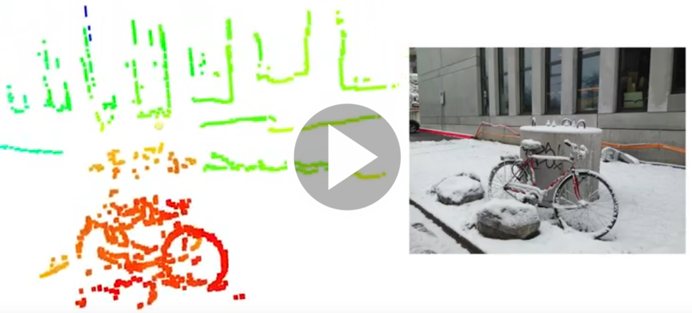](https://youtu.be/EFpZcpd9XJ0)

This is the code for the 2018 IJCV paper [**EMVS: Event-Based Multi-View Stereo - 3D Reconstruction with an Event Camera in Real-Time**](http://rpg.ifi.uzh.ch/docs/IJCV17_Rebecq.pdf) by [Henri Rebecq](http://henri.rebecq.fr), [Guillermo Gallego](http://www.guillermogallego.es), [Elias Mueggler](http://rpg.ifi.uzh.ch/people_mueggler.html), and [Davide Scaramuzza](http://rpg.ifi.uzh.ch/people_scaramuzza.html).

### Citation

A pdf of the paper is [available here](http://rpg.ifi.uzh.ch/docs/IJCV17_Rebecq.pdf). If you use any of this code, please cite this publication as follows:

```bibtex
@Article{Rebecq18ijcv,
  author        = {Henri Rebecq and Guillermo Gallego and Elias Mueggler and
                  Davide Scaramuzza},
  title         = {{EMVS}: Event-based Multi-View Stereo---{3D} Reconstruction
                  with an Event Camera in Real-Time},
  journal       = "Int. J. Comput. Vis.",
  year          = 2018,
  volume        = 126,
  issue         = 12,
  pages         = {1394--1414},
  month         = dec,
  doi           = {10.1007/s11263-017-1050-6}
}
```

### Patent & License

- The proposed EMVS method is patented, as you may find in [this link](https://patentscope.wipo.int/search/en/detail.jsf?docId=WO2018037079).

      H. Rebecq, G. Gallego, D. Scaramuzza
      Simultaneous Localization and Mapping with an Event Camera
      Pub. No.: WO/2018/037079.  International Application No.: PCT/EP2017/071331
    
- The license is [available here](LICENSE).

# Overview

From a high-level, input-output point of view, EMVS receives a set of events and camera poses and produces a semi-dense 3D reconstruction of the scene, as shown in the above video. 
See the [example](#running-example) below.

# Installation

This software depends on [ROS](http://www.ros.org/).
Installation instructions can be found [here](http://wiki.ros.org/kinetic/Installation/Ubuntu).
We have tested this software on Ubuntu 16.04 and ROS Kinetic.

Install [catkin tools](http://catkin-tools.readthedocs.org/en/latest/installing.html), [vcstool](https://github.com/dirk-thomas/vcstool):

    sudo apt-get install python-catkin-tools python-vcstool
    
Create a new catkin workspace if needed:

    mkdir -p ~/emvs_ws/src && cd ~/emvs_ws/
    catkin config --init --mkdirs --extend /opt/ros/kinetic --merge-devel --cmake-args -DCMAKE_BUILD_TYPE=Release

Clone this repository:

    cd src/
    git clone git@github.com:uzh-rpg/rpg_emvs.git

Clone dependencies:

    vcs-import < rpg_emvs/dependencies.yaml

Install `pcl-ros`:

    sudo apt-get install ros-kinetic-pcl-ros

Build the package(s):

    catkin build mapper_emvs
    source ~/emvs_ws/devel/setup.bash

# Running example

Download [slider_depth.bag](http://rpg.ifi.uzh.ch/datasets/davis/slider_depth.bag) data file, from the [Event Camera Dataset](http://rpg.ifi.uzh.ch/davis_data.html), which was recorded using the [DVS ROS driver](https://github.com/uzh-rpg/rpg_dvs_ros). 

**Run the example**:

    roscd mapper_emvs
    rosrun mapper_emvs run_emvs --bag_filename=/path/to/slider_depth.bag --flagfile=cfg/slider_depth.conf

**Configuration parameters**: The options that can be passed to the program using the configuration file (e.g., `slider_depth.conf`) and their default values are defined at the top of the [main.cpp file](mapper_emvs/src/main.cpp). 
These are: the parameters defining the input data, the parameters of the shape and size of the Disparity Space Image (DSI), and the parameters to extract a depth map and its point cloud from the DSI.

# Visualization

## Images

Upon running the example above, some images will be saved in the folder where the code was executed, for visualization.
For example, the output images for the `slider_depth` example should look as follows:

<table border="0" style="width:100%; border:none; border-collapse: collapse;">
  <tr style="border:none;">
    <td align="center" style="border:none;">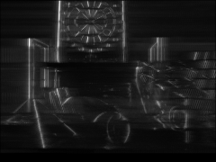</td>
    <td align="center" style="border:none;">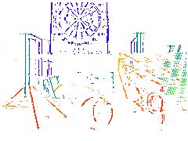</td>
  </tr>
  <tr style="border:none;">
    <td align="center" style="border:none;">Confidence map</td>
    <td align="center" style="border:none;">Depth map</td>
  </tr>
</table>

The depth map is colored according to depth with respect to the reference view.

## Disparity Space Image (DSI)

We also provide Python scripts to inspect the DSI (3D grid).

### Volume Rendering

Install visvis first:

    pip install visvis

To visualize the DSI stored in the `dsi.npy` file, run:

    roscd mapper_emvs
    python scripts/visualize_dsi_volume.py -i /path/to/dsi.npy

You should get the following output, which you can manipulate interactively:

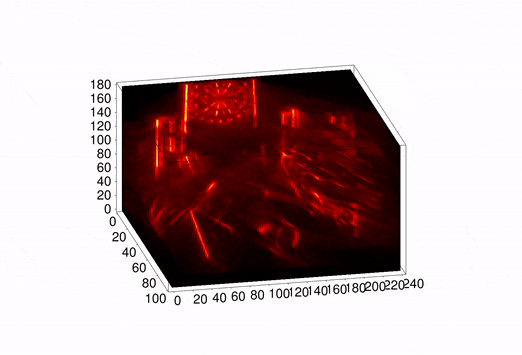

### Showing Slices of the DSI

To visualize the DSI with moving slices (i.e., cross sections), run:

    python scripts/visualize_dsi_slices.py -i /path/to/dsi.npy

which should produce the following output:

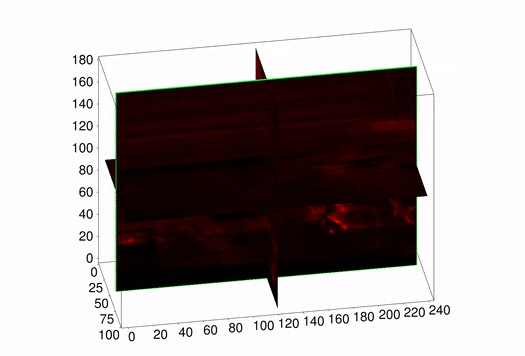

## Point Cloud

To visualize the 3D point cloud extracted from the DSI, install `pypcd` first as follows:

    pip install pypcd

and then run:

    python scripts/visualize_pointcloud.py -i /path/to/pointcloud.pcd
    
A 3D matplotlib interactive window like the one below should appear, allowing you to inspect the point cloud (color-coded according to depth with respect to the reference view):
    
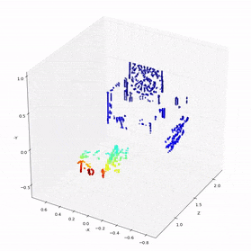


## Additional Examples

We provide additional examples with sequences from the [Event Camera Dataset](http://rpg.ifi.uzh.ch/davis_data.html).

### Office Scene

Download [dynamic_6dof](http://rpg.ifi.uzh.ch/datasets/davis/dynamic_6dof.bag) and run:

    rosrun mapper_emvs run_emvs --bag_filename=/path/to/dynamic_6dof.bag --flagfile=cfg/dynamic_6dof.conf

The images generated should coincide with those in [this folder](mapper_emvs/images/dynamic_6dof).

<table border="0" style="width:100%; border:none; border-collapse: collapse;">
  <tr style="border:none;">
    <td align="center" style="border:none;">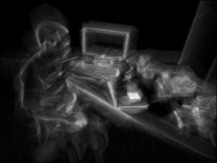</td>
    <td align="center" style="border:none;">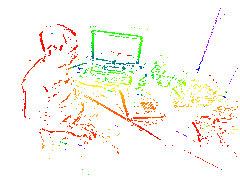</td>
  </tr>
  <tr style="border:none;">
    <td align="center" style="border:none;">Confidence map</td>
    <td align="center" style="border:none;">Depth map</td>
  </tr>
</table>

You may also explore the DSI as in the previous example (the same commands should work).

### Boxes
Download [boxes_6dof](http://rpg.ifi.uzh.ch/datasets/davis/boxes_6dof.bag) and run:

    rosrun mapper_emvs run_emvs --bag_filename=/path/to/boxes_6dof.bag --flagfile=cfg/boxes_6dof.conf

The images generated should coincide with those in [this folder](mapper_emvs/images/boxes_6dof).

<table border="0" style="width:100%; border:none; border-collapse: collapse;">
  <tr style="border:none;">
    <td align="center" style="border:none;">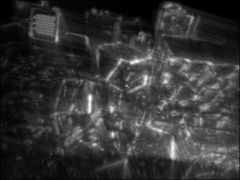</td>
    <td align="center" style="border:none;">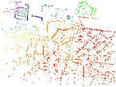</td>
  </tr>
  <tr style="border:none;">
    <td align="center" style="border:none;">Confidence map</td>
    <td align="center" style="border:none;">Depth map</td>
  </tr>
</table>

You may also explore the DSI as in the previous example (the same commands should work).

### Shapes

Download [shapes_6dof](http://rpg.ifi.uzh.ch/datasets/davis/shapes_6dof.bag) and run:

    rosrun mapper_emvs run_emvs --bag_filename=/path/to/shapes_6dof.bag --flagfile=cfg/shapes_6dof.conf

The images generated should be those in [this folder](mapper_emvs/images/shapes_6dof).

<table border="0" style="width:100%; border:none; border-collapse: collapse;">
  <tr style="border:none;">
    <td align="center" style="border:none;">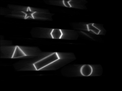</td>
    <td align="center" style="border:none;">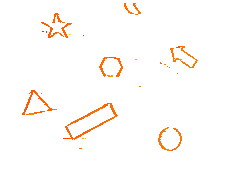</td>
  </tr>
  <tr style="border:none;">
    <td align="center" style="border:none;">Confidence map</td>
    <td align="center" style="border:none;">Depth map</td>
  </tr>
</table>

As you may notice by inspecting the DSI, the shapes are on a plane (a wall). 


## Additional Notes

By default, the Z slices of the DSI are uniformly spaced in inverse depth. 
However, it is possible to change this behavior to use Z slices uniformly spaced in depth (rather than inverse depth).
This can be achieved by changing the option `USE_INVERSE_DEPTH` to `OFF` in the [CMakeLists.txt](mapper_emvs/CMakeLists.txt).
This requires recompiling `mapper_emvs`. We recommend removing the `emvs_mapper` build folder before recompiling. 


# Additional Resources on Event Cameras

* [Event-based Vision Survey](http://rpg.ifi.uzh.ch/docs/EventVisionSurvey.pdf)
* [List of Event-based Vision Resources](https://github.com/uzh-rpg/event-based_vision_resources)
* [Event Camera Dataset](http://rpg.ifi.uzh.ch/davis_data.html)
* [Event Camera Simulator](http://rpg.ifi.uzh.ch/esim)
* [RPG research page on Event Cameras](http://rpg.ifi.uzh.ch/research_dvs.html)
* [EMVS Conference paper, BMVC'16](http://rpg.ifi.uzh.ch/docs/BMVC16_Rebecq.pdf). [PPT](http://rpg.ifi.uzh.ch/docs/BMVC16_Rebecq.pptx), [YouTube](https://youtu.be/EUX3Tfx0KKE)
            
